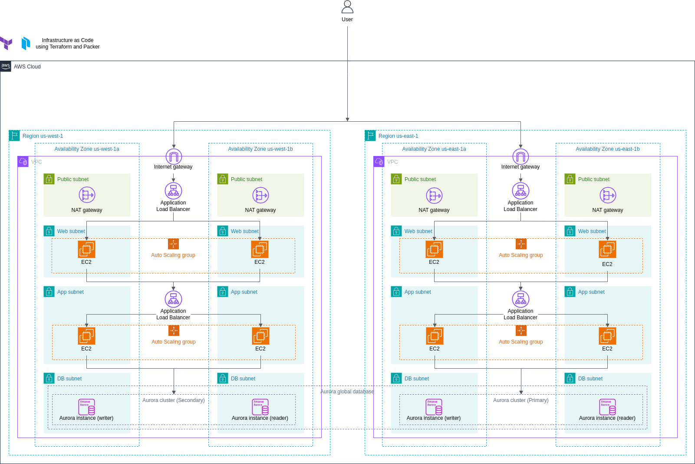
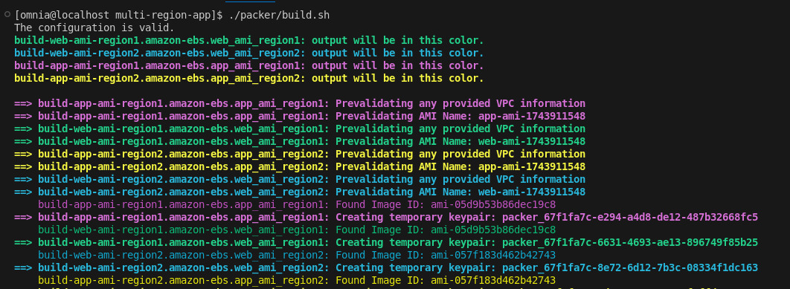
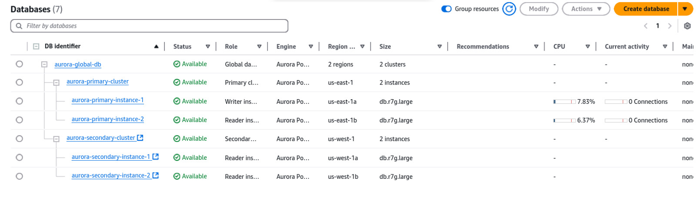

# Multi-Tier Multi-Region Architecture on AWS using Terraform

## 🗭 Overview

This project provisions a highly available and scalable **multi-tier architecture** across **two AWS regions** using **Terraform** and **HashiCorp Packer**.

It implements:
- Infrastructure as Code (IaC)
- Pre-baked AMIs
- Auto Scaling Groups
- Layered subnets (web, app, db)
- Load balancers for traffic distribution
- Modular Terraform design

---

## 📦 Tools Used

- **Terraform** – Provision AWS resources.
- **AWS** – Cloud provider.
- **Packer** – Build reusable AMIs for EC2 instances.

---

## 🌍 Architecture Overview

```


```

- Multi-region setup across `us-east-1` and  `us-west-1` region.
- Resources organized in tiers: Web → App → DB.
- AMIs are created with Packer.
- Auto Scaling ensures scalability and fault tolerance.
- NAT Gateways ensure private subnets can reach the internet securely.
- Aurora Global Database with primary & secondary clusters 


---

## 📦 Packer – Creating AMIs

**Why use Packer?**
- Faster EC2 boot time.
- Reliable, repeatable configurations.

### ✅ Web AMI
- OS: Amazon Linux 2023
- Installs and starts **NGINX**
- Adds a custom landing page (`index.html`)

### ✅ App AMI
- OS: Amazon Linux 2023
- Installs **NGINX**
- Installs PostgreSQL client for DB interaction

### 🛠 Build Commands

in `packer/build.sh`

```bash
cd packer

# Initialize and validate
packer init .
packer fmt .
packer validate -var 'region=us-east-1' web.pkr.hcl

# Build AMI
packer build -var 'region=us-east-1' web.pkr.hcl
```

> AMI IDs must be manually copied and updated in Terraform variables before applying infrastructure.

---

## 📐 Terraform – Infrastructure Modules

Terraform modules are created to isolate responsibilities and ensure reusability.

---

### 🔹 1. `network/` – VPC & Subnets

- Creates a **VPC** per region.
- Public Subnets (for NAT + Load Balancers).
- Private Subnets:
  - Web Subnets 
  - App Subnets
  - DB Subnets 

Also includes:
- **Internet Gateway**
- **NAT Gateways** 
- **Route Tables** and associations

---

### 🔹 2. `web/` – Web Tier

- Application Load Balancer (public)
- Auto Scaling Group using AMI created by Packer
- Launch Template
- Security Groups
  - ALB: Allow HTTP from all
  - EC2: Allow traffic from ALB only

**Load Balancer**
- Listens on port 80
- Distributes traffic to Web ASG EC2s

**Auto Scaling Policy**
- Based on average CPU utilization (target: 50%)

---

### 🔹 3. `app/` – App Tier

- Internal Load Balancer (private)
- Auto Scaling Group using App AMI
- Launch Template
- Security Groups
  - ALB: Accepts traffic only from Web EC2
  - EC2: Accepts from App ALB only

**Auto Scaling**
- Ensures a minimum of 2 EC2s per AZ
- Dynamic scaling enabled

---

### 🔹 4. `db/` – Database Tier

- Aurora Global Cluster
- DB Subnet Groups
- Security Group for PostgreSQL

---

## 🚀 Deployment Steps

### 1. Configure AWS credentials
```bash
aws configure
```

### 2. Build AMIs (Web & App)
```bash

./build.sh

```



### 3. Deploy infrastructure
```bash
cd ..
terraform init
terraform validate
terraform plan
terraform apply
```



---

## ✅ Future Improvements

- Integrate **Route 53** with custom domain.
- Add **GitHub Actions** or **GitLab CI/CD** pipeline for auto-deployment.
- Add **ACM TLS Certificates** to enable HTTPS.
- Use **SSM Session Manager** for secure instance access.
- Add monitoring (CloudWatch alarms, dashboards).

---


